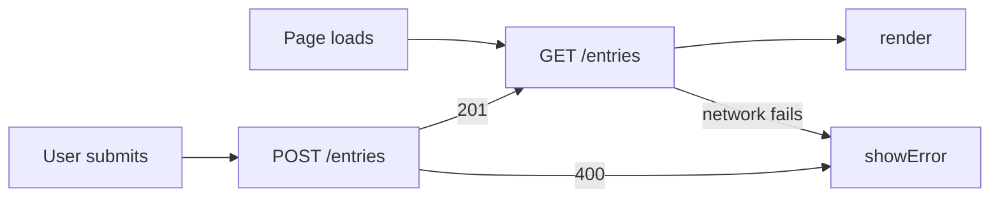

# Entries: Data Leaves the Browser

This HW4 version moves the opt-in directory from browser-only storage to a
deployed Cloudflare Worker backed by D1.

## What

HW3 repository: [mgt3745-hw3](https://github.com/mehtaaashi05/mgt3745-hw3)

The opt-in directory helps interns find employees willing to have a short,
informal conversation about another team, without turning curiosity into a
formal transfer request. It serves hesitant explorers and proactive
outreachers described in [PROJECT.md](context/PROJECT.md) and
[FEATURES.md](context/FEATURES.md). Entries now live in Cloudflare D1 behind
the deployed Worker so they survive cleared browser data and are available to
another client, as recorded in ADR-002.

## See It Work

The deployed endpoint returned the same entry after the browser's site data
was cleared and the page was loaded again.

## How to Run

Deployed Worker: `https://mgt3745-hw4.mgt3745-hw4.workers.dev/`
API: `https://mgt3745-hw4.mgt3745-hw4.workers.dev/entries`

From a fresh Codespace:

1. Open the repository in a Codespace. The devcontainer installs xdg-utils and runs `npm install`.
2. `npx wrangler login --device`, then follow [docs/SESSION_B_COMMANDS.md](docs/SESSION_B_COMMANDS.md)
   to create the database, run the schema, and deploy.
3. Paste the deployed URL into `app.js` as `API`.
4. Right-click `index.html`, choose **Open with Live Server**.

To run the Worker locally instead: `npm run dev` (port 8787, local D1 emulator).

## Status

| Feature | EARS statement | Verdict |
|---|---|---|
| Save an entry | WHEN a valid entry is submitted, THE SYSTEM SHALL store it | PASS |
| Reject empty entry | IF text is missing, THEN THE SYSTEM SHALL reject with a reason | PASS |
| Survive cleared cache | THE SYSTEM SHALL return stored entries on any device | PASS |
| Network down | IF the server is unreachable, THE SYSTEM SHALL tell the user | CANNOT TEST YET |
| Two clients, one table | WHEN two clients write, THE SYSTEM SHALL preserve both valid entries | DEFERRED (ADR-002) |

Full verification table lives in [FEATURES.md](context/FEATURES.md).

## Links

Reading order for a stranger: [PROJECT.md](context/PROJECT.md) →
[USERS.md](context/USERS.md) → [FEATURES.md](context/FEATURES.md) →
[ARCHITECTURE.md](context/ARCHITECTURE.md) → [STANDARDS.md](context/STANDARDS.md) →
[TOOLS.md](context/TOOLS.md) → [STYLE.md](context/STYLE.md) →
[CLAUDE.md](context/CLAUDE.md)

## AI Use

*Three proto-DDR questions. What did the agent write? What did you check,
and how? What could you not fully verify, and what did you do about it?
For the Worker specifically: name the thing you could not fully inspect.
Hours spent: ___.*
