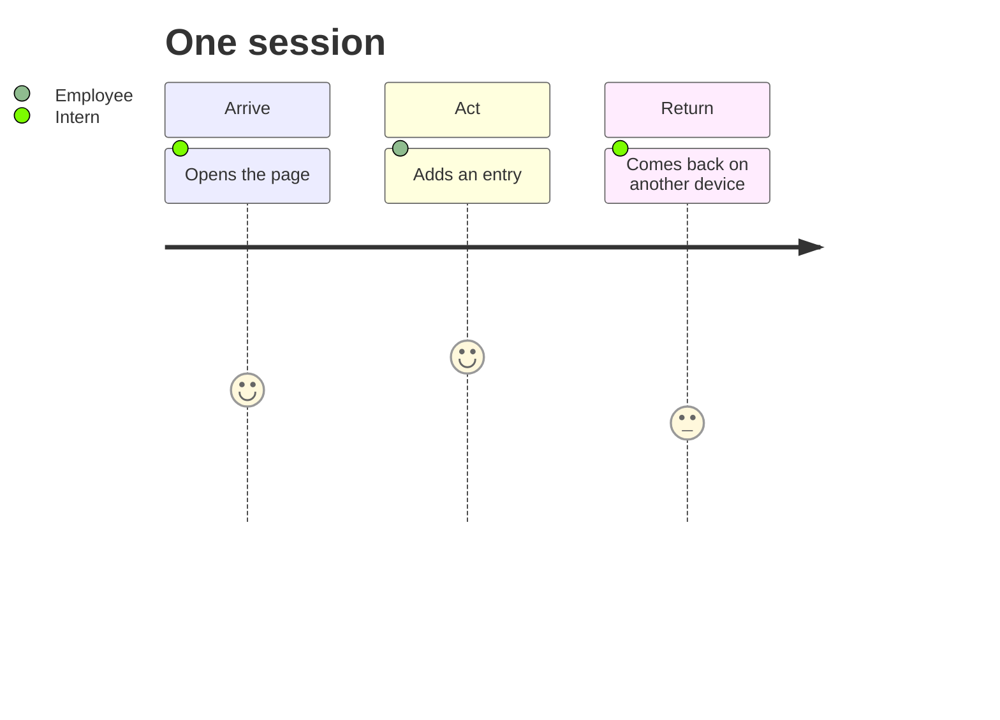

# USERS.md

# User research and jobs

## Interview synthesis

### INT-01
INT-01 / Manager, Corporate & Institutional Banking Program / 09-02-2026

INT-01 described two contrasting interns: one built an informal connection with the credit team, asked questions, and eventually moved to underwriting; another was curious about credit but never reached out directly, asked peers instead, and let the internship end without pursuing it.

Reported: Most managers "understand that interns are exploring their careers"; fear of looking disloyal is "more of a concern than something that necessarily happens." No formal process exists to "test out" another team. Observed: Successful explorers started with an informal conversation, not a formal transfer request. Inferred: How the ask is framed ("tell me what your team does?" vs. "I want to move to credit") affects perceived risk more than who is asked.

Surprises: risk was perceived more than enforced; success came from informal framing.

Evidence: Confirms interns perceive reputational risk. Challenges the assumption that the risk is materially enforced by managers.

### INT-02
INT-02 / Intern, Treasury Management pursuing Business Credit / 09/03/2026

INT-02 became curious about Business Credit a few weeks in. He hesitated before acting, then began reaching out cold to first-year analysts to ask questions and shadow informally, confirming his interest before pursuing an official switch.

Reported: He hesitated because he didn't want his manager to think he was unhappy, and worried about his return offer. Once he raised it, the reaction was "pretty positive": "I was worried about the risk for nothing." Observed: A gap between the risk he anticipated and the support he actually received once he spoke up. Inferred: He initially wanted to validate his interest, not switch teams outright; once decided, he wanted his team's support.

Surprises: weeks of delay over a risk that didn't materialize; his team's reaction was supportive, not punitive.

Evidence: Confirms fear of disloyalty delayed action. Challenges the assumption that the risk is real or enforced.

## Two job statements
JOB-01: When I am curious about a team I am not placed on, I want to learn what the work is actually like without it reading as a request to leave, so I can decide whether the interest is real before making it formal. Evidence: INT-01, INT-02.

JOB-02: When I want to learn about a team I am curious about, I want to find someone there willing to talk with me, so I do not have to depend on already knowing the right person or getting lucky. Evidence: INT-02.

## Two user profiles
PROFILE-01 — The Hesitant Explorer: Becomes curious about another team within the first few weeks, with no connection into it yet (known). Wants to learn about the work without it reading as dissatisfaction (known). Currently limited to asking peers, yielding incomplete, secondhand information (assumed). How long the hesitation typically lasts is inferred.

PROFILE-02 — The Proactive Outreacher: Reaches out directly to junior team members on the team of interest, without prior connection, to ask questions and shadow informally (known). Wants firsthand validation before formally pursuing a move, without waiting for an introduction (known). Depends on cold outreach being well-received. Whether it holds with more senior contacts, or outside corporate banking, is inferred.

Two exploratory interviews do not establish population prevalence; broader claims would need more interviews.

## Primary user

The primary user is the Hesitant Explorer: an intern browsing from a laptop
who wants firsthand information about another team without signaling a desire
to leave. Their friction is not knowing whom to approach and fearing that a
direct request will be misread.

## Secondary user

The secondary user is the Proactive Outreacher: an employee who has opted in
and adds a short fictional description of what they can discuss. They want
interested interns to find them without managing individual introductions.

## Journey

